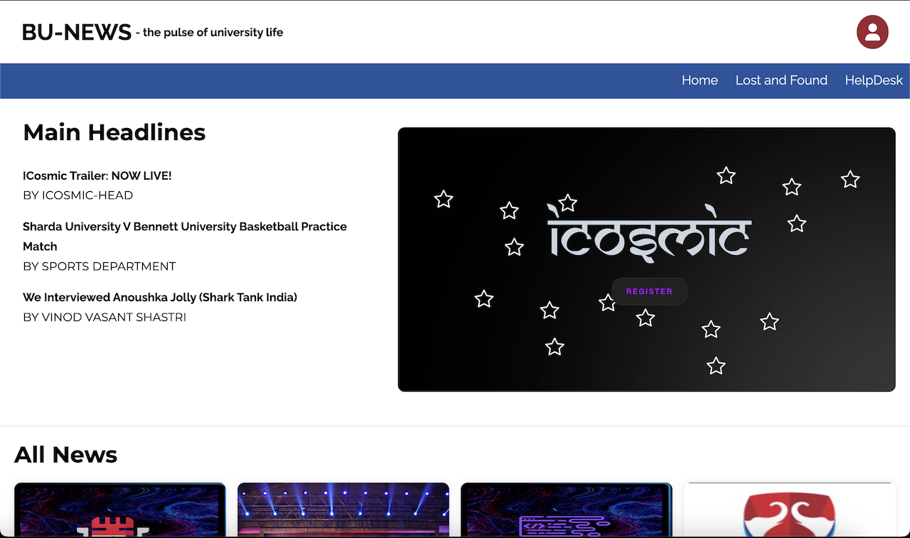
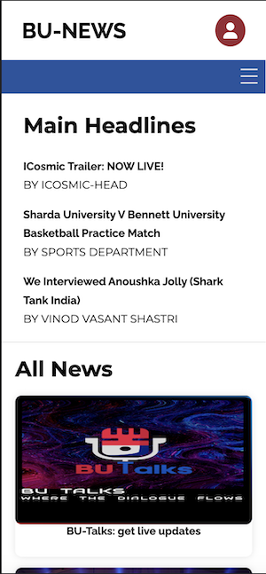

| Desktop View | Mobile View |
|--------------|-------------|
|||  

> https://bu-news.netlify.app/
> https://github.com/ChiragAgg5k/bu-news

## About

BU News is a news website application built using pure HTML, CSS and JavaScript. It is a responsive website that can be viewed on both desktop and mobile devices. It is a multiple page application that allows the students to post their own news and articles based on current university events.

The posts are administered by the admin of the website. The admin can add, edit and delete the posts. The posts are stored in a SQL database and are fetched from the database to be displayed on the website.

## Technologies Used

- HTML
- CSS
- JavaScript
- MySQL
- PHP

## Team Members

The project was built for a hackathon named HackEye conducted by ICosmic, Bennett University. The team members are:

- [Chirag Aggarwal](https://github.com/ChiragAgg5k)
- [Aman Boora](https://github.com/boora-aman)
- [Ishang Kansal](https://github.com/IshangKansal)
- [Divesh Saini](https://github.com/divesh0001)
- [Nikhil](https://github.com/n1kk-08)

## Note

This project was part of our first ever hackthon as well as our first ever web development project. We are still learning and improving our skills. We would love to hear your feedback and suggestions.